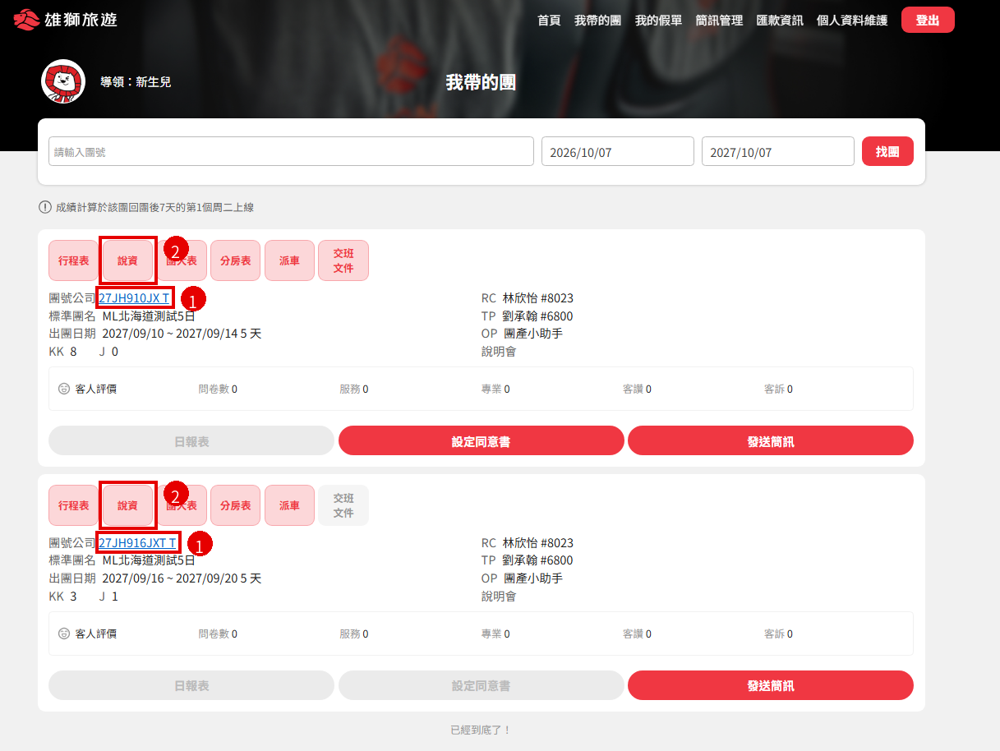

# Q信箱、說資 10/19 起全線停止紙本列印

## 公告

【公告】10/19 起 Q信箱、說資不再提供紙本，請改至導領E化平台查看  

各位產品同仁、領隊好：  

自 2026/10/19（一）起，全部線別（1 美加、2 紐澳、3 歐洲、4 亞非、5 大陸港澳、6A 日本、6C 韓國、7 東南亞、9 台灣、璽品、郵輪、運動、鐵道、高球）的 OP 將不再列印「Q信箱」及「說資」紙本，請領隊直接登入「導領E化平台」查看線上版。  
（7 東南亞線已於 9/24 提前上線）  

▍查看方式  
登入導領E化平台 →「我帶的團」→ 找到該團  
① Q信箱：點選藍色「團號」即可查看  
② 說資：點選「說資」按鈕，會開啟 B2C 網頁詳版說資  

▍注意事項  
・出團交班前請先確認能正常開啟，若有問題請洽該團 OP / RC / TP。  
・線上版內容即時更新，以線上版為準。  
・平台使用上若有異常或功能建議，歡迎填寫導領平台【異常回報】&【功能建議】表單：https://forms.gle/8yWZbAWn2cVpstSS9  

感謝大家配合，一起邁向無紙化！  

## 功能位置說明

1. **Q信箱**：在「我帶的團」頁面，點選每團的藍色團號（例：27JH910JX T）。
2. **說資**：點選上方「說資」按鈕，會開啟 B2C 網頁的詳版說資。

## 佈達 Check list（10/19 前完成）

### 依負責人

- [ ] 跟主管佈達｜Eason｜完成時間：
- [ ] 跟二力佈達｜浩然｜完成時間：
- [ ] 跟產品佈達｜各線二力｜完成時間：
- [ ] 公告 & 二力森友會公告｜欣怡｜完成時間：

### 依線別

| 線別 | 主管佈達（Eason） | 二力佈達（浩然） | 產品佈達（各線二力） |
|---|---|---|---|
| 1 美加 | ☐ | ☐ | ☐ |
| 2 紐澳 | ☐ | ☐ | ☐ |
| 3 歐洲 | ☐ | ☐ | ☐ |
| 4 亞非 | ☐ | ☐ | ☐ |
| 5 大陸港澳 | ☐ | ☐ | ☐ |
| 6A 日本 | ☐ | ☐ | ☐ |
| 6C 韓國 | ☐ | ☐ | ☐ |
| 7 東南亞 | ✅ 09/24 | ✅ 09/24 | ✅ 09/24 |
| 9 台灣 | ☐ | ☐ | ☐ |
| 璽品 | ☐ | ☐ | ☐ |
| 郵輪 | ☐ | ☐ | ☐ |
| 運動 | ☐ | ☐ | ☐ |
| 鐵道 | ☐ | ☐ | ☐ |
| 高球 | ☐ | ☐ | ☐ |
| **全部完成** | ☐ | ☐ | ☐ |

> 7 東南亞線已於 9/24 提前上線。
